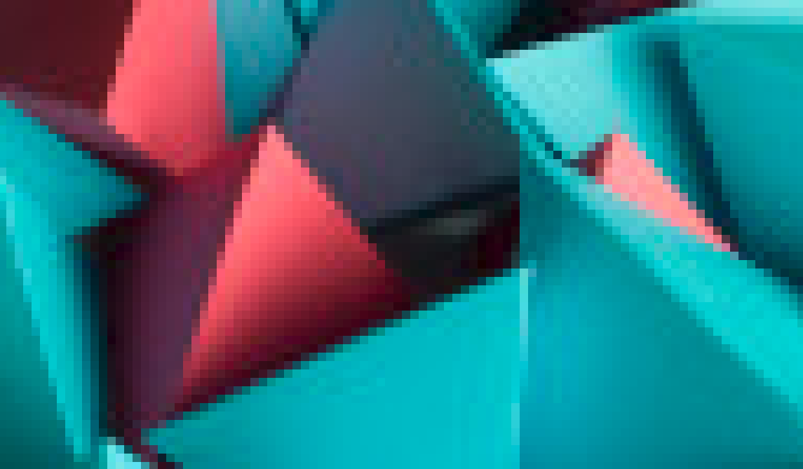
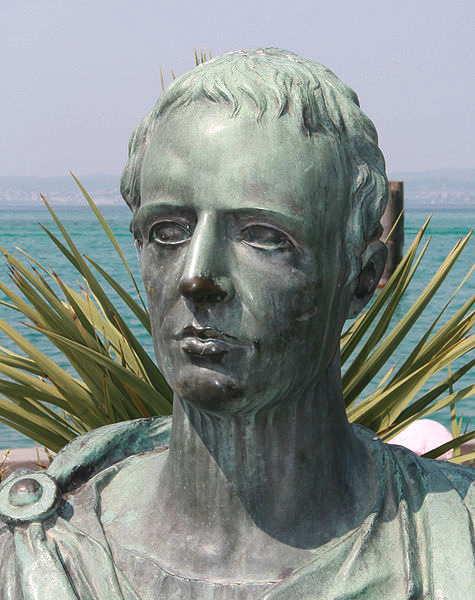
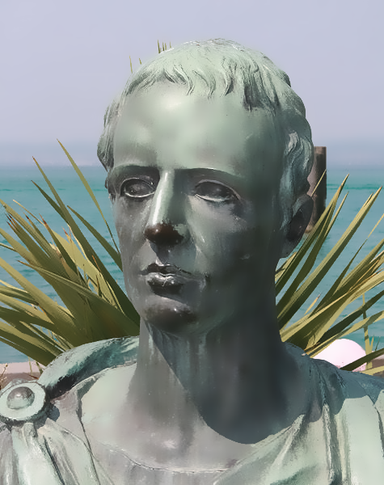

# smooth-image

> by Andrew D'Amario © January 2023

Python image de-noising script to remove artifacts and smoothen images while preserving definition and quality.

## Usage

```shell
python smooth-image.py IMAGE RADIUS THRESHOLD
```

- IMAGE: image filename (path), supports png, jpg, and bmp
- RADIUS: radius of pixels to smoothen
- THRESHOLD: threshold of colour difference to smoothen

## Examples

**Original image:**



**Command:**
```shell
python smooth-image.py triangles.png 2 80
```
**Smoothened image:**


---

**Original image:**



**Command:**
```shell
python smooth-image.py Catullus.png 10 80
```
**Smoothened image:**



