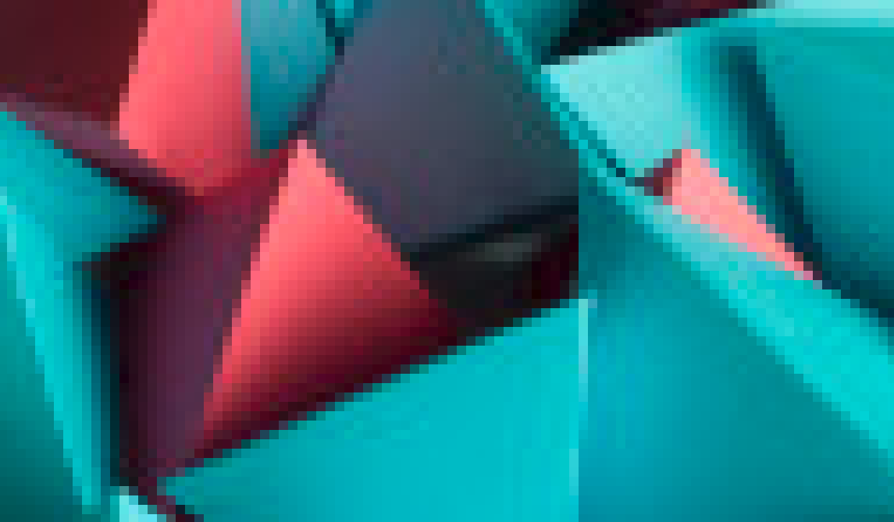
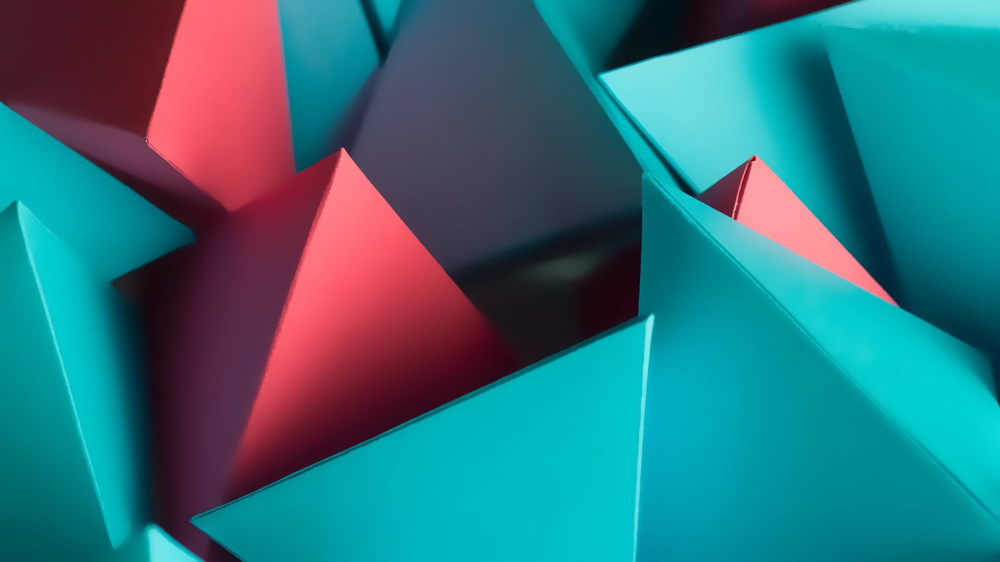
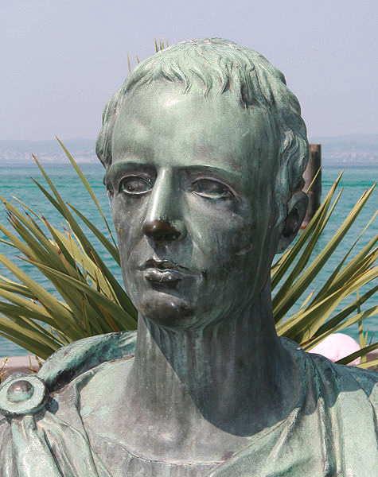
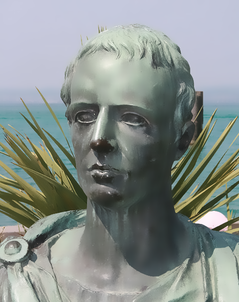

# smooth-image

> by Andrew D'Amario © January 2023

Multithreaded image enhancing script that removes artifacts and smoothens images while preserving definition and quality.

## Usage

```shell
python smooth-image.py IMAGE RADIUS THRESHOLD
```

- IMAGE: image filename (path), supports png, jpg, and bmp but **png** is recommended
- RADIUS: radius of pixels to smoothen (the greater, the softer the smoothening)
- THRESHOLD: threshold of colour difference to smoothen (the higher, the more the image is blurred)

**Output:** Image with the same filename-smooth and image type.

## Examples

**Original image:**



**Command:**
```shell
python smooth-image.py media/triangles.png 2 80
```
**Smoothened image:**


---

**Original image:**


**Command:**
```shell
python smooth-image.py media/triangles-full.png 20 80
```
**Smoothened image:**



---

**Original image:**



**Command:**
```shell
python smooth-image.py media/Catullus.png 10 80
```
**Smoothened image:**




### Credits
- https://en.wikipedia.org/wiki/Catullus
- https://wallpapersden.com/3d-triangle-cube-wallpaper/1920x1080/

